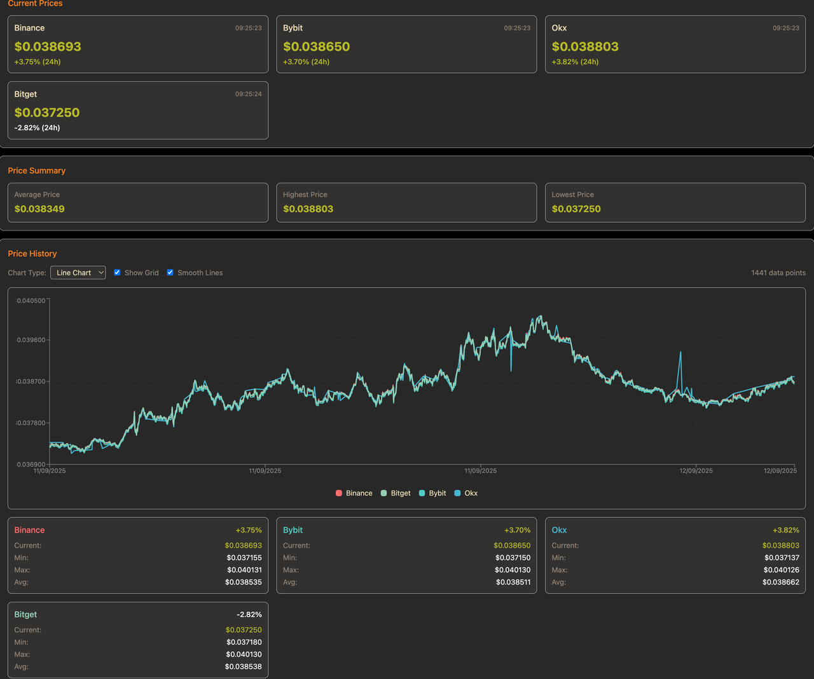
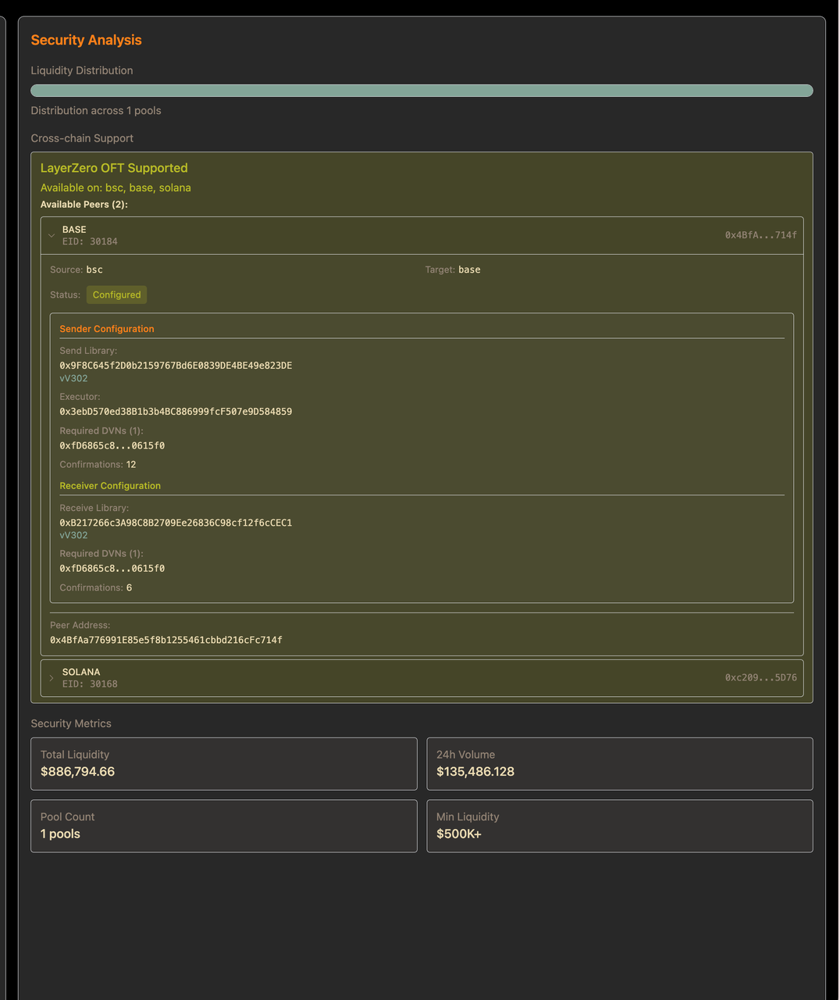

# DexAI - Arbitrage Visualization & Analysis Tool

DexAI is a visualization and analysis tool designed to assist with arbitrage opportunities in the cryptocurrency market. This project focuses on providing real-time insights into price differences across various exchanges and decentralized platforms.

## Features

- **Price Monitoring**: View price comparisons across different exchanges, DEX spots, and exchange perpetuals over the past 24 hours
  
- **Pool Analysis**: Analyze current token liquidity pools and their characteristics
  

- **Bridge Analysis**: Monitor cross-chain bridge activities (currently integrated with LayerZero)
  

## Project Focus & Limitations

This project is designed for **small community use** and is currently focused on **feature development** rather than enterprise-grade production deployment.

### Code Quality

- **Refactoring Opportunities**: The codebase has room for refactoring and improvement
- **Development Focus**: Prioritizing feature implementation over code optimization
- **Performance**: Not focusing on extensive performance optimizations at this stage
- **No Metrics & Analytics**: Not integrated with Sentry for error tracking and monitoring, with analytics tools for comprehensive metrics collection and dashboards
- **UI Design**: No production-level UI design; interface is designed for small community use with basic functionality and readability standards

### Testing Strategy

- **Integration Tests**: API endpoints include integration tests for external service validation
- **No Unit Tests**: Currently not prioritizing comprehensive unit test coverage

### Authentication & Access

- **No User Login System**: Authentication is handled through API key storage in localStorage
- **Community Access**: Designed for small community usage rather than public deployment

## What This Project Does NOT Include & How to Address These Limitations

- **High-Performance Matching Engine**: See [matching system](./docs/Decentralized-matching-system.md) for details
- **Arbitrage Features**: Additional arbitrage functionality examples can be found in [Arb Code Example](./docs/Arb-Example-Code/README_exchange_experience.md)

## Project Structure

This project is organized as a monorepo using pnpm workspaces and Turborepo:

**Note**: The nested folder structure exists because this demo code was extracted from a larger monorepo, with irrelevant parts removed for this specific arbitrage visualization use case.

```
0xDevAI-demo/
├── apps/
│   └── web-dashboard/              # Next.js web interface for arbitrage visualization
│       ├── app/                     # Next.js app directory
│       │   ├── api/                # API routes for token data, pools, etc.
│       │   ├── tokens/             # Token analysis pages and components
│       │   └── hooks/               # React hooks for data fetching
│       └── lib/                     # Utility libraries
├── packages/
│   ├── core/                       # Core utilities (logging, caching, security)
│   └── api-clients/                # External API integrations
│       ├── blockchain/             # Blockchain and DEX integrations
│       │   ├── binance/            # Binance API client
│       │   ├── okexchange/         # OKX exchange API client
│       │   ├── layerzero/          # LayerZero bridge integration
│       │   ├── moralis/            # Moralis blockchain data
│       │   └── onchain/            # On-chain data providers
│       └── common/                 # Shared API client utilities
└── logs/                           # Application logs
```

## Code Review Suggestions

If you want to explore the codebase, here's where to find the main functionality:

### Price Aggregation

- **API Routes**: `apps/web-dashboard/app/api/tokens/` - Token price endpoints
- **Data Fetching**: `apps/web-dashboard/app/hooks/useTokenPrices.ts` - Price data hooks
- **Exchange Integrations**: `packages/api-clients/src/blockchain/` - Binance, OKX, and other exchange APIs
- **Frontend Components**: `apps/web-dashboard/app/tokens/components/PriceChart.tsx` - Price visualization

### Pool Analysis

- **API Routes**: `apps/web-dashboard/app/api/tokens/pools/` - Pool data endpoints
- **Data Fetching**: `apps/web-dashboard/app/hooks/useTokenPools.ts` - Pool data hooks
- **On-chain Data**: `packages/api-clients/src/blockchain/onchain/pools/` - Pool and tick analysis
- **Frontend Components**: `apps/web-dashboard/app/tokens/components/LiquidityPools.tsx` - Pool visualization

### Bridge Analysis

- **API Routes**: `apps/web-dashboard/app/api/tokens/` - Bridge data endpoints
- **LayerZero Integration**: `packages/api-clients/src/blockchain/layerzero/` - Bridge transaction monitoring
- **Frontend Components**: `apps/web-dashboard/app/tokens/components/` - Bridge analysis components

## Getting Started

### Prerequisites

- Node.js 18+
- pnpm 8+

### Installation

1. Clone the repository:

   ```
   git clone https://github.com/yourusername/dex-ai.git
   cd dex-ai
   ```

2. Install dependencies:

   ```
   pnpm install
   ```

3. Set up environment variables:

   ```
   cp .env.example .env.local
   ```

   Edit `.env.local` with your API keys and configuration.

4. Start the development environment:
   ```
   pnpm dev
   ```

## Development

- `pnpm build`: Build all packages and applications
- `pnpm dev`: Start development servers
- `pnpm test`: Run tests
- `pnpm lint`: Lint code

## License

MIT
