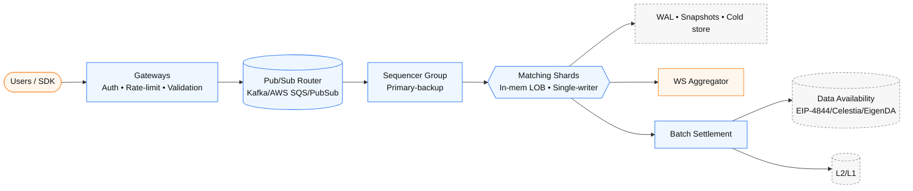
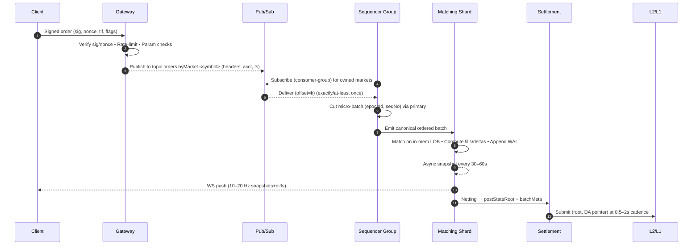

# High-Performance, Trust-Configurable Decentralized Matching System – Design & Implementation

## 1) Background & Objectives

This system targets a **deterministic, auditable** off-chain matching engine with **on-chain batch settlement**, optimized for **≥10k order-events/s** and **≤100 ms** match latency.

Objectives:

- Low latency matching (≤100 ms) and high throughput (≥10k TPS aggregated).
- Horizontal scalability by **market sharding** (optionally sub-sharding hot markets).
- **Internally trusted consensus** for ordering (primary–backup); optional observers.
- System-wide **crash safety** (snapshots + logs) and **deterministic replay**.
- Batch settlement with optional **DA** (data availability) and proof hooks.

---

## 2) System Overview

---

## 3) Gateway Design

Responsibilities:

- **Auth & Anti-replay**: verify signature (secp256k1/Ed25519), check nonce/window, reject stale/replay.
- **Rate limiting**: per account/IP token buckets; global surge control. Graceful 429 + backoff hints.
- **Risk filters**: tick/lot/price bounds, per-account live-order cap.
- **Ingress to Pub/Sub**: publish orders/cancels to the **Routing topics** with minimal headers (market, account, ts, schema ver).

---

## 4) Routing via Pub/Sub

Why Pub/Sub helps:

- Natural **backpressure** and **durable queues**
- Clean separation between **ingress** (gateways) and **ordering** (sequencers).

Design:

- Gateways **publish** to `orders.byMarket.<symbol>`.
- Each **Sequencer group** **subscribes** to the markets it owns (consumer-group semantics ensure one group instance gets each message).

---

## 5) Sequencer (Internally Trusted)

### 5.1 Why

- We need a single canonical order for fairness.

### 5.2 Primary–Backup (Leader–Follower)

- A **single leader** cuts **micro-batches** (e.g., every 50 ms) → assigns `(epochId, seqNo)`.
- Followers mirror input stream and **validate** leader’s batch; if leader down, **failover** via keepalive/lease.
- Pros: minimal latency/overhead. Cons: single ordering authority (but trusted).

---

## 6) Sharded Matching Engine

Sharding:

- Each shard owns its **in-memory Limited Order Book(LOB)**; single-threaded event loop.

In memory Limited Order Book:

- Structure: price-level arrays → FIFO queues; maker/taker fee calc.
- **Cold storage** for far-price queues; pointers/summaries kept in RAM.

---

## 7) Settlement & Data Availability

### Why

- Matching happens off-chain for speed, but settlement happens on-chain for security.
- We batch results so costs stay low while still keeping everything final.
- Data availability (e.g. blobs, DA layers) ensures anyone can later check the full history.

---

## 8) End-to-End Failure & Replay Story

- Gateway dies: restart; no state loss (Pub/Sub retains).
- Router/Mapping bug: messages land in DLQ; fix mapping → re-ingest.
- Sequencer leader crash: follower elects new leader; **offsets** ensure no gaps/dupes.
- Shard crash: reload **snapshot**, replay Write-Ahead Log to current `epochId`.

---

## 10) Operational Parameters

- Micro-batch window: **25–75 ms** (start at 50 ms).
- Snapshot cadence (shards): **30–60 s** (async).
- Pub/Sub retention: **≥ 6–24 h**.
- Raft/primary timeouts: leader lease **150–300 ms**; heartbeat **50 ms**.
- Settlement cadence: **0.5–2 s** per batch.
- UI push frequency: **10–20 Hz**.

---
