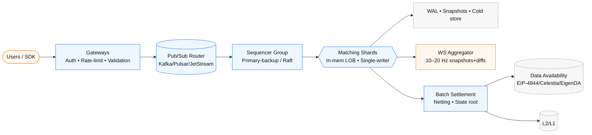

# High-Performance, Trust-Configurable Decentralized Matching System – Design & Implementation

## 0) What changed in this revision

- **Routing**: describe a **Pub/Sub–centric** routing option (with why/when).
- **Sequencer**: remove full BFT; adopt an **internally-trusted, simplified consensus** (Raft/primary-backup).
- **Persistence & Rollback**: cover **every component**, not just the LOB.

---

## 1) Background & Objectives

This system targets a **deterministic, auditable** off-chain matching engine with **on-chain batch settlement**, optimized for **≥10k order-events/s** and **≤100 ms** match latency. We assume an **internally trusted operator set** (no adversarial operators), and we design for smooth evolution toward more trust-minimized modes later.

Objectives:

- Low latency matching (≤100 ms) and high throughput (≥10k TPS aggregated).
- Horizontal scalability by **market sharding** (optionally sub-sharding hot markets).
- **Internally trusted consensus** for ordering (primary–backup / Raft); optional observers.
- System-wide **crash safety** (snapshots + logs) and **deterministic replay**.
- Batch settlement with optional **DA** (data availability) and proof hooks (future-ready).

---

## 2) System Overview

Pipeline: **Client → Gateway → Routing (Pub/Sub) → Sequencer (primary–backup/Raft) → Matching Shards (in-mem LOB) → Persistence (WAL+Snapshots+Cold) → Settlement (batch root + DA) → Chain**.
Frontends consume **WebSocket aggregated updates** (10–20 Hz), not per-event firehose.



```
sequenceDiagram
  autonumber
  participant C as Client
  participant G as Gateway
  participant P as Pub/Sub
  participant Q as Sequencer Group
  participant M as Matching Shard
  participant S as Settlement
  participant L as L2/L1

  C->>G: Signed order (sig, nonce, tif, flags)
  G->>G: Verify sig/nonce • Rate-limit • Param checks
  G-->>P: Publish to topic orders.byMarket.<symbol> (headers: acct, ts)
  Q-->>P: Subscribe (consumer-group) for owned markets
  P-->>Q: Deliver (offset=k) (exactly/at-least once)
  Q->>Q: Cut micro-batch (epochId, seqNo) via primary/Raft
  Q->>M: Emit canonical ordered batch
  M->>M: Match on in-mem LOB • Compute fills/deltas • Append WAL
  M-->>M: Async snapshot every 30–60s
  M-->>C: WS push (10–20 Hz snapshots+diffs)
  M->>S: Netting → postStateRoot + batchMeta
  S->>L: Submit (root, DA pointer) at 0.5–2s cadence
```

---

## 3) Gateway Design

Role: first point of trust & hygiene.

Responsibilities:

- **Auth & Anti-replay**: verify signature (secp256k1/Ed25519), check nonce/window, reject stale/replay.
- **Rate limiting**: per account/IP token buckets; global surge control. Graceful 429 + backoff hints.
- **Risk filters**: tick/lot/price bounds, per-account live-order cap.
- **Ingress to Pub/Sub**: publish orders/cancels to the **Routing topics** with minimal headers (market, account, ts, schema ver).

Persistence & rollback (Gateway):

- **Stateless by design**; do not persist hot state.
- Access logs & **idempotency cache** (short TTL) for duplicate submits.
- On crash/restart: no replay responsibility; upstream **Pub/Sub** retains the truth.

---

## 4) Routing via Pub/Sub (recommended)

Why Pub/Sub helps:

- **Fan-in/fan-out** without writing bespoke routers.
- Natural **backpressure** and **durable queues** (e.g., Kafka/NATS JetStream/Pulsar).
- Clean separation between **ingress** (gateways) and **ordering** (sequencers).
- Live **market→committee mapping** using topic conventions or header keys.

Design:

- Topic taxonomy:
  - `orders.raw` (optional pre-validation stream)
  - `orders.byMarket.<symbol>` or `orders.byShard.<id>`
  - `orders.ctrl.mapping` (mapping updates; sequencers subscribe)

- Gateways **publish** to `orders.byMarket.<symbol>`.
- Each **Sequencer group** **subscribes** to the markets it owns (consumer-group semantics ensure one group instance gets each message).
- **Repartitioning** a market = update mapping → sequencer resubscribes (zero-downtime handover with “drain & cutover” window).

Persistence & rollback (Routing/Pub-Sub):

- **Durable log** with retention (e.g., hours–days).
- **Exactly-once or at-least-once** delivery; dedupe via `(trader, clientOrderId)` on subscriber.
- On sequencer crash: restart from **consumer offset** → deterministic replay.
- On routing/mapping error: use **dead-letter topics**, manual re-ingest after fix.

---

## 5) Sequencer (Internally Trusted)

Remove full BFT; pick one:

### 5.1 Primary–Backup (Leader–Follower)

- A **single leader** cuts **micro-batches** (e.g., every 50 ms) → assigns `(epochId, seqNo)`.
- Followers mirror input stream and **validate** leader’s batch; if leader down, **failover** via keepalive/lease.
- Pros: minimal latency/overhead. Cons: single ordering authority (but trusted).

### 5.2 Raft-style (consensus under trust)

- 3–5 nodes; **leader election** + **log replication**.
- Commit when **majority** ack (fast in single region).
- Pros: automatic consistency & failover. Cons: slightly higher overhead than primary-backup.

Batch structure:

- Header: `epochId`, `t_close`, input Merkle root, leader id, prevBatchRoot.
- Body: ordered ops `(account, clientOrderId, side, px, qty, tif, flags, sig, nonce)`.
- Output: canonical order stream to **matching shards**.

Persistence & rollback (Sequencer):

- **Replicated WAL** (Raft log or leader WAL + follower shadow log).
- On crash: reload last committed epoch, **resume from Pub/Sub offset**.
- On failover: followers already caught up; next leader continues epoch cutting.
- On configuration change (repartition markets): **drain current epoch**, checkpoint offsets, switchover.

---

## 6) Sharded Matching Engine

Sharding:

- **By market**; hot markets can sub-shard by **price bands** or **account hash**.
- Each shard owns its **in-memory LOB**; single-threaded event loop (lock-free hot path).

LOB:

- Structure: price-level arrays → FIFO queues; maker/taker fee calc; reduce-only/IOC/PO handling.
- **Optimizations**: price-band compaction, GTT/TTL, per-account live-order caps.
- **Cold storage** for far-price queues; pointers/summaries kept in RAM.

Persistence & rollback (Shards/LOB):

- **Shard WAL**: append orders/cancels/fills; include `epochId, seqNo`.
- **Periodic snapshots**: full LOB + per-account risk cache (every 30–60 s, async).
- Crash recovery: load snapshot → replay WAL up to current epoch (deterministic).
- Rollback trigger (upstream correction): revert to **parent checkpoint**, replay with amended batch stream.

---

## 7) Settlement & Data Availability

Settlement:

- **Netting** per account/market within batch → compact **state delta**.
- Submit `(postStateRoot, batchMeta, DA pointer)` every **0.5–2 s** to L2/L1.

Data Availability:

- Store **batch inputs + fills** in DA (EIP-4844 blobs / Celestia / EigenDA).
- Users can prove **inclusion** of their orders and **post-state** balances.

Proofs (optional, future-ready):

- **Optimistic**: publish immediately; keep a challenge window off-chain/side-chain governance.
- **ZK hook**: define the transition statement now; integrate a prover later without redesigning I/O shapes.

Persistence & rollback (Settlement/DA):

- Keep **batch ledger** (append-only) with L1/L2 tx ids.
- If a batch must be voided (ops error): mark **replaced**; submit corrective batch (contract must support lineage).
- DA retention ≥ dispute horizon; mirror to object storage for auditing.

---

## 8) Client Updates (WebSocket Aggregation)

- Do **not** stream every event. Push **snapshots + throttled deltas** (10–20 Hz).
- Coalesce multi-fills into one UI tick; include top-N book levels and last trades.
- Backpressure slow clients; drop to **snapshot-only** mode if needed.

Persistence & rollback (Client layer):

- Stateless. If a UI misses ticks, request **delta since seq** or pull a **fresh snapshot**.

---

## 9) End-to-End Failure & Replay Story (one look)

- Gateway dies: restart; no state loss (Pub/Sub retains).
- Router/Mapping bug: messages land in DLQ; fix mapping → re-ingest.
- Sequencer leader crash: follower/raft elects new leader; **offsets** ensure no gaps/dupes.
- Shard crash: reload **snapshot**, replay WAL to current `epochId`.
- Settlement glitch: mark batch superseded; post corrective batch; chain enforces **parent→child** lineage.
- Full audit: reconstruct from **DA + logs** and recompute postStateRoot to verify.

---

## 10) Operational Parameters (typical)

- Micro-batch window: **25–75 ms** (start at 50 ms).
- Snapshot cadence (shards): **30–60 s** (async).
- Pub/Sub retention: **≥ 6–24 h**.
- Raft/primary timeouts: leader lease **150–300 ms**; heartbeat **50 ms**.
- Settlement cadence: **0.5–2 s** per batch.
- UI push frequency: **10–20 Hz**.

---
